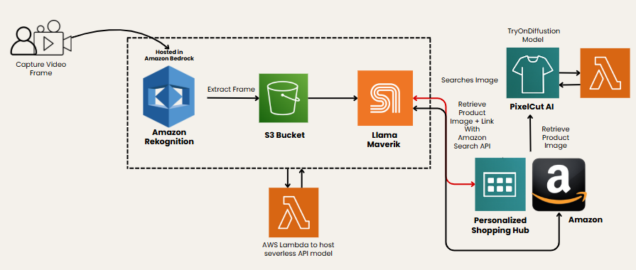

# 🏆 DripSeek – AI-Driven Fashion Discovery

> **Top Honors — NEXT Hackathon, SuperAI Conference 2025 (Singapore)**  
> Built in 36 hours. Real-time fashion discovery from streaming media.

---

# Project Highlights
- **Hackathon:** Top 4 / 300+ applicants. https://www.superai.com/next-hackathon
- **Prototype Time:** 36 hours
- **Core Idea:** Browser plugin that identifies clothes on-screen and helps users shop similar looks with a virtual try-on (DripTry).

---
# SuperAI-DripSeek

This project is a React.js web application that integrates with AWS Lambda serverless functions to provide advanced AI-powered features for product try-on and search.
 - DripSeek is a browser plugin that identifies the clothes worn by actors in real time on streaming platforms such as Prime Video, allowing users to instantly shop for similar styles.
- The DripTry feature enables customers to virtually test the fit before purchasing.
- Inspired by DeepSeek, the name DripSeek reflects the vision of seamless, AI-driven fashion discovery.

# Architecture Overview



# Video Demo

[▶️ Watch the Demo Video](DripSeek%20Demo%20Vid.mp4)

## Features

1. **AWS Lambda Serverless Functions**
   - **Try On Studio**: Enables users to virtually try on products using AI models.
   - **AWS Bedrock Rekognition**: Utilizes Amazon's Rekognition for image analysis.
   - **API Model + Amazon Search API**: Integrates with Amazon's APIs to search for more products and enhance recommendations.

2. **Frontend**
   - Built with React.js and Vite for fast development and hot module replacement.

## Getting Started

### Prerequisites
- Node.js (v16 or higher recommended)
- npm (comes with Node.js)

### Installation & Running the App

1. Install dependencies:
   ```bash
   npm i
   ```
2. Start the development server:
   ```bash
   npm run dev
   ```
3. Open your browser and navigate to the local server URL (usually [http://localhost:5173](http://localhost:5173)).

---

For AWS Lambda and API integration, ensure you have the necessary AWS credentials and endpoints configured. Refer to the project documentation or contact the maintainer for backend deployment and environment setup.
